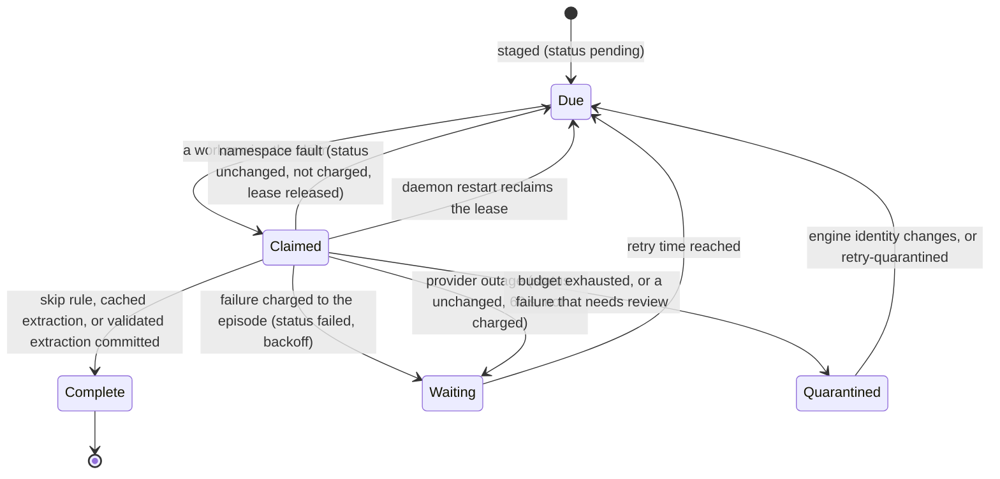

# Ingestion pipeline

This is the design reference for how a source becomes facts. It describes the
rules the daemon follows, not the commands to run it. For commands and diagnosis
see [operations](operations.md). For the evidence rules that decide whether a
fact is accepted see [transcript sources](transcript-sources.md).

## Overview

```text
source file → intake (staging) → durable episode → claim → extraction → validation
                                                                          ↓
                                       journal entry ← commit ← checkpoint of model work
```

One daemon process per namespace runs a scan loop and a pool of workers. The
scan loop stages new source content as episodes. Workers claim episodes, call
the model, validate the result and commit facts. Neo4j holds the queue, the
leases, the retry state and the evidence. The daemon keeps no state on disk.

## Episode states

An episode has three persisted statuses: `pending`, `failed` and `complete`.
Everything else is derived from other properties at read time.

| Derived state | How it is recognised |
| --- | --- |
| Due | Status `pending` or `failed`, retry time reached, no live lease, not quarantined for the running engine |
| Claimed | A lease that has not expired |
| Waiting | Retry time still in the future |
| Quarantined | `quarantine_engine` equals the running engine identity |



A completed episode never returns to the queue. Staging the same content again
returns the existing receipt.

## Intake

Intake turns files into episodes. It never calls a model.

**Memory bank.** Each scan lists the mounted roots, skips files whose
modification time, size and inode are unchanged, and stages new content in one
transaction per file. Content already in the graph is recognised by its hash
with file dates left out, so a touched file or a new mount does not import the
same text twice.

**Transcripts.** Each session file has a `MemoryFeed` node that stores how many
messages were consumed and a hash of that prefix. A file whose consumed prefix
changed is refused. New messages become batches of at most eight messages, with
four earlier messages as context. With source records a batch also holds at most
90,000 characters, and at most four batches are staged per file per scan.

Source-records intake is bounded so that a large archive cannot flood the queue:

- **Queue gate.** Intake counts episodes that are due now: status `pending` or
  `failed`, retry time reached, not quarantined for the running engine. This is
  the same quarantine rule the workers use. When the count reaches
  `MEMORY_INTAKE_QUEUE` (default 32) the scan leaves the remaining source on disk.
- **File budget.** One scan opens at most `MEMORY_INTAKE_FILES` files (default 4)
  that stage work or still have work left. Confirming that a file is already fed
  does not use the budget.
- **Time limit.** A scan stops opening files after 120 seconds.
- **Rotating cursor.** The scan resumes after the last file it examined. Files
  that change on every scan cannot use the budget ahead of the files behind them.
- **Caught-up stamps.** When a file is fully fed, its feed node records the
  file's modification time and size. A restarted daemon loads these stamps and
  skips unchanged files without parsing them.

Staging links only the nodes of the episode being staged: its session, messages
and artifact observations. It does not rescan the namespace for missing links.
Restoring links across a namespace is the explicit `repair` command.

All staging pauses while the queue is paused, whether the cause is the provider
or a namespace fault. That covers transcript intake and the memory-bank scan,
which logs `bank_scan` with `skipped: queue_paused`. Staging during a pause
would only build a queue that no worker can drain.

## Claim and lease

A worker reads up to 16 of the oldest due episodes and shuffles them. Idle
workers would otherwise all try the single oldest episode and all but one would
lose a write.

The claim is one conditional write on the episode node. The write takes the
node's lock and the conditions are evaluated again under it, so exactly one
concurrent claimant succeeds. The winner sets a lease expiry and a random token.
Later bookkeeping matches on that token, so a worker whose lease was replaced
cannot change the episode.

The lease lasts four model timeouts plus 60 seconds, with a minimum of 900
seconds. One episode can take two extraction passes of two model calls each. With
the default timeout of 420 seconds the lease is 1,740 seconds. The worker clears
the lease when it finishes, whatever the outcome.

One daemon owns a namespace's queue. At start it clears every live lease in the
namespace, because a lease left by the previous process would otherwise block
its episode until expiry. Two daemons on one namespace would release each
other's leases. A `--once` run leaves leases alone because it may share the
namespace with a running daemon.

## Extraction run

One run of a claimed episode follows this order.

1. **Cached extraction.** If the episode holds a validated extraction from the
   same engine identity and the same provider, model and effort, the worker
   validates it again against the source and commits it. No model call is made.
2. **Skip rule.** For source-record and direct MCP episodes, a fact must cite a
   new message, and only a user assertion, an assistant report, or a tool result
   can be new evidence. If no focus message has one of those
   types, the episode is committed empty without a model call. The receipt
   carries `skipped: no_claim_in_focus`. Other formats always go to the model.
3. **Model call.** The model receives the transcript, matching existing entities
   and their relationships, and the rejection feedback of the previous run if
   one is stored. A reply that fails the schema gets one correction call.
4. **Evidence validation.** If validation rejects the candidate, the worker makes
   one more extraction pass with the rejected candidate and the diagnostic. A
   second rejection fails the run.
5. **Checkpoint.** The validated extraction is saved on the episode as
   `cached_extraction` before the graph commit. If the commit fails, the next run
   starts at step 1 and the model work is not paid for again.
6. **Commit.** Entities are resolved against the current graph and facts are
   written with their evidence. The commit and its journal entry share one
   transaction.

The worst case is two passes of two calls each, which is why the lease covers
four model timeouts.

## Quote repair and evidence rules

Validation runs in two steps. It first repairs every quote in the extraction.
It then applies the focus and role rules to the evidence as repaired. A quote
that repair moved to another message is held to that message's role and focus,
so moving a quote cannot sidestep those rules.

The focus rule requires each fact of a feed batch to cite at least one new
message, and that message must be a claim or a tool result. Any other message
type in focus is context. Plain transcripts carry no roles, so any of their
messages qualifies.

Evidence must be text that occurs in the cited message. Models often copy a
passage with small differences, so validation looks for the source span a quote
points at instead of rejecting on the first difference.

Tolerated differences between the quote and the source:

- Markdown markup characters (`*`, `_`, `` ` ``, `~`, `\`).
- Line-number prefixes at the start of a line of the source. They are stripped
  from the source only, and only when the quote does not match without doing so.
  A quote keeps its own leading digits because they are content: "2023: grew"
  must not pass for a source that says 2024.
- Any amount or kind of whitespace.
- Accents, and composed versus decomposed Unicode forms.
- The right text under the wrong message id, when exactly one message in the
  transcript contains it.

Still rejected:

- A quote whose normalised form is shorter than 12 characters.
- A quote that matches more than one place in the message.
- Text that does not occur in the transcript, including paraphrase, translation,
  case changes, ellipses and passages joined from separate spans.
- A repaired span longer than 4,000 characters.

When a quote is repaired, the stored evidence is replaced by the exact source
span, including the combining marks of its last character. Stored evidence is
therefore always verbatim source text. The extraction hash stored on a completed
episode is the hash of the evidence as committed. Sending the same unrepaired
extraction again is still recognised as a replay, not as a conflict.

Validation collects every bad quote in an extraction and reports up to ten
locations in one diagnostic. A correction pass that learned of one bad quote per
attempt could not finish within the retry budget.

## Failures, retry budget and backoff

Every failure is classified into a closed set of reason codes. What the code is
decides who pays for the failure.

| Class | Examples | Charged to the episode | Effect |
| --- | --- | --- | --- |
| Validation failure | `evidence_quote_mismatch`, `schema_validation`, `unvalidated_assistant_claim` | Attempt and validation failure | Backoff |
| Needs review | `ambiguous_identity`, `extraction_conflict`, a cached extraction that no longer validates | Attempt | Quarantined at once |
| Other episode failure | Database error at commit, `unclassified_error` | Attempt | Backoff |
| Provider outage | `model_timeout` or `model_invocation_failed` while the breaker opens or is open | Nothing | Status unchanged, retry in 60 s |
| Model failure that follows the episode | The same codes while the provider serves other episodes | `infra_failures` | Status unchanged, retry in 60 s |
| Namespace fault | `journal_state_mismatch`, `engine_changed` | Nothing | Status unchanged. The worker stops claiming. See below |

**Backoff.** A charged attempt delays the next try by 60 seconds doubled for each
earlier attempt: 60, 120, 240, 480, 960, 1,920 and 3,600 seconds. Counters
recorded under an older engine identity do not count.

**Retry budget.** An episode is quarantined under the running engine when any of
these is reached:

- three validation-failed runs. A run includes its correction calls, so three
  runs can mean up to twelve model calls;
- three model timeouts or crashes that were not part of an outage. A timeout
  that follows one episode around while other episodes succeed is that
  episode's problem;
- eight charged attempts of any kind. Without this limit an episode with a
  persistent database or unclassified error would retry every hour indefinitely.

A provider outage and a namespace fault never count toward any of the three.

**Rejection feedback.** The latest validation failure is stored on the episode:
reason, location and the rejected candidate, within size limits. The next run
gives it to the model as untrusted repair context. Provider failures do not
overwrite it, and an engine change makes it ineligible.

## Quarantine

A quarantined episode stays `failed` and keeps its source, its rejected
candidate and its feedback. Workers skip it while the engine identity is the one
that quarantined it. `memory_status.processing.quarantined` counts these episodes.

Two things release it. A new engine identity makes it due again, because new
extraction code may succeed where the old code failed. An operator can release
one episode with `retry-quarantined`, which resets its attempts, validation
failures and model failures. It also clears the cached extraction, because a
saved extraction that was rejected would be rejected again. The cache is kept
only when the episode was set aside for a model timeout or crash.

## Circuit breaker

A provider outage says nothing about an episode. The breaker stops model calls
while the provider is failing, so an outage does not use retry budgets or start
calls that cannot succeed.

- It opens after three provider failures with no success between them. It opens
  on the first failure when the reason is `usage_limit`, `authentication` or
  `model_unavailable`, because every call will fail until someone acts.
- While open, workers do not claim episodes. One probe is admitted per wait.
  The wait starts at 60 seconds. Only a failed probe doubles it, up to 900
  seconds. Eight workers failing together when the break opens do not lengthen it.
- Only a model call can close the break. A completed run closes it if it made a
  model call. A run that the validator rejected also closes it, because the
  provider answered. A skipped, cached or replayed episode says nothing about
  the provider and leaves the break open.
- A probe that ended without a model call, for example because nothing was due,
  is released and the next probe is admitted after about 5 seconds.
- Every admitted call carries the state it started under. An outcome that
  arrives after the break opened or closed belongs to the past and is ignored.

The daemon logs `provider_unavailable` when the breaker opens and after each
failed probe, and `provider_recovered` when it closes. Both carry `open`,
`reason` and `retry_in`. The worker heartbeat records the open state, so
`memory_status.workers` reports `provider_unavailable` with the reason.

## Namespace faults

Two faults belong to the namespace or the process. The next episode would fail
the same way, so no episode is charged, marked failed or quarantined for them.
They pause the queue through the same breaker, opened at once, but they are
announced under their own names: `namespace_fault` when the pause starts and
after each failed probe, `namespace_recovered` when a probe succeeds. Provider
events keep their names.

- **`journal_state_mismatch`.** The graph no longer matches its journal.
  Writes stay refused until an operator resolves it. See
  [operations](operations.md#journal-maintenance).
- **`engine_changed`.** The engine files on disk differ from the ones the
  process loaded. The daemon drains and exits with reason `engine_changed`, and
  the container supervisor starts a new process with the new code.

## Engine identity

The engine identity is a hash of the files that decide which facts an episode
yields, listed in `version.ENGINE_FILES`, plus the major and minor versions of
the Neo4j driver and Pydantic. Cached extractions, quarantines, rejection
feedback and dreams are keyed by it.

Operational code is left out on purpose. A change to the CLI, the MCP layer, the
daemon or the status tool does not release every quarantined episode or discard
every cached extraction.

## Model invocation

The transcript is untrusted and the Codex CLI is an agent, so extraction runs
with nothing an agent could use.

- `codex exec` runs in a new temporary directory with `--ephemeral`,
  `--ignore-user-config`, `--ignore-rules`, a read-only sandbox and web search
  disabled. Every agent tool feature is switched off through config overrides,
  which a CLI version without that feature tolerates.
- The output must match the JSON Schema of the extraction model.
- The process receives only what the CLI needs: `PATH`, `HOME`, `CODEX_HOME`,
  locale and temporary-directory variables, certificate and proxy settings, and
  `OPENAI_API_KEY` or `CODEX_API_KEY` when set. The database password and the
  MCP token are not passed on.
- The CLI runs in its own process group. On timeout the whole group is killed,
  including anything the CLI started. `MEMORY_LLM_TIMEOUT` sets the timeout in
  seconds (default 420, allowed 10 to 600). The upper bound keeps four calls
  inside the worker container's 45 minute stop grace period.
- The CLI's error stream can repeat prompt text. Only the CLI's own `ERROR`
  lines are read, so transcript text can never decide that the provider is down.
  They are reduced to one of a closed set of reasons: `usage_limit`,
  `rate_limit`, `authentication`, `model_unavailable`, `network`, `timeout` or
  `unknown`. The text itself is never logged or stored.

The compatible HTTP adapter maps HTTP status codes to the same reasons.

## Journal write path

Every knowledge write and its journal entry share one transaction under the
namespace lock. Leases, retries, feedback, cached extractions and quarantine
marks are operational state and are not journaled.

**Scoped writes.** Stage, commit, retract and merge declare the nodes they are
about to change before writing them. The journal reads those nodes before and
after the write and records the property differences. The cost follows the size
of the change, not the size of the graph. A write that changes nothing appends
no entry.

**State hash.** The state hash is the sum of one hash per node, modulo 2^256.
The sum does not depend on order, so a scoped write updates it by subtracting
the old node hashes and adding the new ones, without reading the rest of the
graph.

**Full-capture writes.** Dream and revision operations still capture the whole
namespace before and after the write. They compare the captured state with the
journal head first and refuse to write on a mismatch.

**Where untracked writes are detected.** A scoped write does not read the whole
graph, so it cannot notice a change made outside the journal. Detection happens
in `history verify-live`, in `history verify`, in `history checkpoint`, in any
full-capture write, and in the sampled audit. `verify-live` streams the live
graph and compares its hash with the journal head. It takes seconds and constant
memory, which makes it the routine check. `verify` also reads the whole history. With `MEMORY_JOURNAL_AUDIT=N`, the writes whose sequence is a
multiple of `N` stream the live graph and compare its hash with the head. `1`
checks every write and `0` turns the audit off. A sampled audit skips writes
that changed nothing.

**Checkpoints.** Only a baseline and an explicit `history checkpoint` embed the
full state in an event. There are no periodic snapshots, because a periodic full
snapshot grows with the graph. Historical reads start at the latest checkpoint
at or before the requested change and replay differences from there, checking
the hash chain and the state hash of every event. Journals written by earlier
versions embedded a snapshot every 100 changes. Those remain readable.

**Format migration.** Journals written before the per-node hash carry a digest
of the whole state. The first write by the current code checks that digest,
then stores the new hash in both head fields. An older process then fails its
own state check and cannot append to the journal. The step cannot be undone
without restoring a backup.

## Confirming an uncertain fact

An assistant's claim with no validating tool result is stored as `uncertain` and
undated. A person can vouch for it with `memory_confirm`. The fact keeps its status
and its evidence, so the record still says how it was learned. It gains the
confirmation time, the note, and a date: the one given, or the time the cited
message was written. Recall then treats it as established from that date, and it
competes for its slot like any confirmed fact. The confirmation is a journaled
change to that one fact, so knowledge as of an earlier change still shows the doubt,
and `memory_retract` takes the fact out again. Only an uncertain fact that has not
been retracted can be confirmed.
